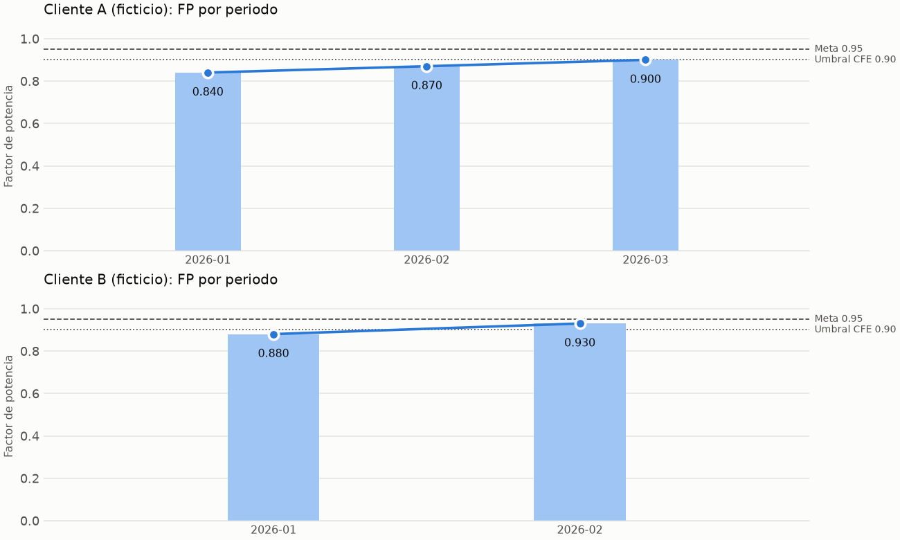

# ⚡ Power Factor Analyzer: FP, compensación reactiva y ROI

Pipeline ETL en Python que toma la tabla de recibos CFE de clientes
industriales y hace cuatro cosas. Diagnostica el factor de potencia (FP).
Estima el cargo o la bonificación de CFE. Dimensiona el banco de capacitores
para llegar al FP objetivo. Calcula ahorro mensual y retorno de la inversión.
Nace de un proyecto de clase COIL (Tec de Monterrey, Campus León × USFQ) para
Kiin Energy, reescrito desde cero como pipeline tipado y probado.

> **Todos los datos de este repo son FICTICIOS.** `data/sample/coil_sample.xlsx`
> reproduce la plantilla del curso (5 recibos inventados de 2 clientes) con el
> nombre del cliente anonimizado. El material del curso (incluido un recibo CFE
> real que se usó para verificar la fórmula) vive en `reference/`, que está en
> `.gitignore` y **no se publica**.

## Contexto

La plantilla del curso define un contrato de 3 hojas:

| Hoja | Contenido | Quién la llena |
|---|---|---|
| `01_Datos_Facturacion` (en el xlsx: "Hoja 1") | 1 fila = 1 cliente en 1 mes. `fp_actual` llega como **texto** (`'0.84'`). | entrada |
| `02_Analisis_Economico_Tecnico` | estado del FP, penalización/bonificación, Qc, capacitancia, banco, ahorro, ROI | este pipeline |
| `03_Resultados_Negocio` | resumen ejecutivo por `id_registro` | este pipeline |

Los cuadernos de Colab originales (semanas 2 a 4) tenían lógica reutilizable pero
con defectos. Por ejemplo, un FP de `1.2` se "corregía" a `0.012` y un kW
negativo se volvía positivo en silencio. Este repo no copia esa lógica: la
reimplementa con reglas explícitas y tests.

## Arquitectura

Patrón Extract → Transform → Load con funciones puras en cada capa. Ningún
cálculo lee archivos y ningún módulo de IO calcula.

```
xlsx ──► extract ──► clean ──► analysis ─────────────► report ──► xlsx (7 hojas)
          │           │         ├─ diagnose (estado, ajuste CFE)   ├─► calidad_datos.csv
          │           │         ├─ compensation (Qc, µF, banco)    └─► plot ──► tendencia_fp.png
          │           │         └─ roi (ahorro, ROI, plantilla)
          │           └─► DataQualityReport (anomalías por fila y tipo)
          └─► ValueError si falta una columna obligatoria (fail fast)
```

| Módulo | Responsabilidad |
|---|---|
| `config.py` | `Settings` inmutable (`frozen dataclass`) con validación. Presets `13200_estrella`, `480_delta` y `440_delta`. |
| `schemas.py` | Modelos Pydantic `frozen` + `extra="forbid"`: `BillingRecord` (entrada limpia), `Sheet2Row` y `Sheet3Row` (salida). El orden de columnas se verifica contra el contrato. |
| `extract.py` | Lee la hoja como `object` (conserva `'0.84'` tal cual). Solo normaliza espacios en encabezados y valida columnas. |
| `clean.py` | Parseo de números y FP, política de kW negativo, duplicados, consistencia FP vs kWh/kVArh. Produce el `DataQualityReport`. |
| `diagnose.py` | `classify_fp`, `cfe_adjustment_pct/mxn`, `economic_impact`. |
| `compensation.py` | `required_kvar`, `capacitance_per_phase_uf`, `suggest_commercial_size`. |
| `roi.py` | `monthly_savings_mxn`, `simple_roi_months`, `template_savings_mxn`. |
| `analysis.py` | Compone lo anterior por registro (`RecordAnalysis`). Existe para no tener un import circular entre `report` y el orquestador. |
| `report.py` | Construye y escribe las hojas; `resumen_reporte` en texto. |
| `plot.py` | Barras + línea por cliente contra la meta, con la API `Figure` (sin estado global de pyplot). |
| `pipeline.py` / `cli.py` | Orquestador y CLI (`argparse`, sin dependencias extra). |

Salida (`--output output/analisis.xlsx`): las hojas `01`–`03` del contrato
**con exactamente sus columnas**, más `04_Comparacion_Plantilla`,
`05_Calidad_Resumen`, `06_Calidad_Detalle` y `07_Supuestos`. El contrato del
curso prohíbe agregar columnas a las hojas compartidas, por eso lo adicional va
en hojas aparte.

## Decisiones de diseño

- **Fail fast + escalación documentada.** Lo que se corrige sin ambigüedad se
  corrige y se reporta como `aviso`. Lo que requeriría adivinar se marca como
  `excluida` y no entra al cálculo. Aun así, la fila sigue visible en las hojas
  02/03 con estado `Sin diagnóstico` y el motivo, así que nada desaparece en
  silencio.
- **Nunca se imputa.** Un FP irrecuperable no se reemplaza por el promedio del
  cliente ni por el mes anterior.
- **kW negativo: `negative_kw_policy="reject"` por defecto.** Un kW negativo
  puede ser flujo inverso (p. ej. generación fotovoltaica, que es justo el
  negocio de Kiin Energy) o una convención de signo del medidor. Aplicar
  `abs()` en silencio convertiría un dato que merece una pregunta en uno que
  parece correcto. `"abs"` existe para quien ya confirmó la convención, y aun
  así deja un aviso.
- **Comas ambiguas.** `'37,303'` se lee como miles. `'0,84'` se rechaza, porque
  puede ser decimal europeo o un error de captura.
- **Duplicados.** Si el `id_registro` se repite con valores idénticos, se
  conserva la primera fila. Si se repite con valores distintos, se excluyen
  todas las copias: no hay forma de saber cuál recibo es el bueno. Lo mismo
  aplica al mismo cliente y periodo con distinto id (el histórico del recibo
  real trae OCT 25 dos veces).
- **Fronteras en punto flotante.** `FP == 0.90` se compara con
  `math.isclose(abs_tol=1e-9)`. Así `0.3*3` (= 0.8999999999999999) sigue
  siendo "Neutro".
- **Parámetros, no números mágicos.** Voltaje, conexión, serie comercial,
  coeficientes y topes CFE viven en `Settings`, y cada corrida los escribe en
  la hoja `07_Supuestos`.

## Reglas de negocio

| Regla | Implementación |
|---|---|
| Conversión de FP | Texto → float. `(0, 1]` válido. `[50, 100]` → ÷100 con aviso (`90.48` → `0.9048`). `'90.48%'` → ÷100. `(1, 50)`, `> 100` o `<= 0` → **irrecuperable**, se excluye. |
| Rangos físicos | kW > 0, voltaje > 0, frecuencia > 0, FP en (0, 1], subtotal ≥ 0 (en `clean`, en Pydantic y en cada función de cálculo). |
| Columnas obligatorias | `ValueError` con la lista exacta de las que faltan. |
| Estado del FP | `Penalización` si FP < 0.90, `Neutro` si FP = 0.90, `Bonificación` si FP > 0.90, `Meta cumplida` si FP ≥ `fp_objetivo` (tiene precedencia). |
| Ajuste CFE (`# TODO verificar contra tarifa vigente`) | Cargo % = 3/5 · (0.90/FP − 1) · 100, tope 120 %. Bonificación % = 1/4 · (1 − 0.90/FP) · 100, tope 2.5 %. Base = `subtotal` (SUPUESTO). |
| Qc | P = `demanda_max_kw`. Qc = P · (tan φ1 − tan φ2), φ = acos(FP). Qc = 0 si FP ≥ objetivo. |
| Capacitancia por fase | Estrella: C = Qc·1000 / (ω·V²). Delta: C = Qc·1000 / (3·ω·V²). V = voltaje de línea. Se reporta en µF. |
| Banco comercial | Siguiente tamaño ≥ Qc de la serie 5, 10, 15, 20, 25, 30, 40, 50, 60, 75, 100 kVAr (serie didáctica del curso). Si Qc > 100: n × 100 + el tamaño que cubra el remanente, y se marca "validar con ingeniería". |
| Ahorro mensual | Ajuste CFE(FP actual) − ajuste CFE(`fp_objetivo`), con cargo positivo y bonificación negativa. Incluye el cargo evitado y la bonificación *incremental*, nunca la que el cliente ya recibe. |
| ROI | `costo_banco_capturado_mxn` / ahorro, en meses. `None` si ahorro ≤ 0 o si falta el costo (nunca divide entre cero). |
| `impacto_neto_mxn` | Bonificación − penalización (convención del contrato del curso: negativo = costo). |

Verificación a mano incluida en los tests:
- P = 71 kW, FP 0.9048 → 0.95 da Qc = **10.08 kVAr**.
- Con 13 200 V en estrella: C = **0.1534 µF**.
- Con 480 V en delta: C = **38.68 µF**.
- Delta da exactamente 1/3 de la capacitancia de estrella al mismo voltaje. También se verifica contra la derivación por fase (Qc/3 con V/√3).

### Verificación contra el recibo real (pregunta abierta)

El único recibo real disponible (tarifa GDMTH, periodo DIC 25) muestra una
**bonificación por FP de −627.56 MXN**. El pipeline no lee ese recibo; los
números se probaron a mano y quedaron fijados en
`test_reference_receipt_is_reproduced_with_historic_fp`.

| FP usado | Fuente en el recibo | Base "Energía" 104,225.03 | ¿Reproduce −627.56? |
|---|---|---|---|
| 0.9048 | bloque principal ("Factor de potencia %") | −138.23 | **No** |
| 0.9088 | calculado con kWh / kVArh del periodo | −253.32 | No |
| 0.9222 | tabla de consumo histórico, fila DIC 25 | −627.25 | **Sí** (diferencia 0.31 MXN, explicable por redondeo del FP) |

La fórmula estándar sí reproduce el monto, pero **solo con el FP del
histórico**, no con el del bloque principal que usa la plantilla del curso. No
sé por qué el recibo muestra dos FP distintos para el mismo periodo. Hasta
confirmarlo con CFE o con Kiin Energy, la fórmula queda marcada como
`TODO verificar contra tarifa vigente`.

## Resultados sobre la muestra

`python -m power_factor.cli run --input data/sample/coil_sample.xlsx --output output/sample/analisis.xlsx`
(preset `13200_estrella`, `fp_objetivo = 0.95`):

| id_registro | FP | Estado | Impacto neto | Qc (kVAr) | µF/fase | Banco | Ahorro/mes | ROI (meses) |
|---|---|---|---|---|---|---|---|---|
| ARNESES_202601 | 0.84 | Penalización | −8,507.14 | 133.25 | 2.0285 | 140 (100 + 40) ⚠ | 11,118.98 | 8.27 |
| ARNESES_202602 | 0.87 | Penalización | −4,164.83 | 102.36 | 1.5583 | 105 (100 + 5) ⚠ | 6,813.51 | 13.50 |
| ARNESES_202603 | 0.90 | Neutro | 0.00 | 64.59 | 0.9833 | 75 | 2,580.26 | 35.66 |
| METALBAJIO_202601 | 0.88 | Penalización | −2,027.73 | 65.43 | 0.9961 | 75 | 3,984.31 | 17.57 |
| METALBAJIO_202602 | 0.93 | Bonificación | +1,233.06 | 21.63 | 0.3292 | 25 | 778.78 | 89.88 |

⚠ = el Qc excede la serie comercial (máx. 100 kVAr) y se marca para revisión
de ingeniería. Con `--preset 480_delta` el Qc no cambia, pero la capacitancia
por fase sube a 82.99–511.35 µF.

### Por qué no coincide con el ahorro prellenado de la plantilla

La plantilla trae `ahorro_mensual_estimado_mxn = |FP − 0.90| / 0.90 · subtotal`.
La hoja `04_Comparacion_Plantilla` calcula esa fórmula junto a la nuestra
(`ahorro_plantilla`, `diferencia_vs_plantilla`):

| id_registro | Nuestro ahorro | Plantilla | Diferencia | Motivo |
|---|---|---|---|---|
| ARNESES_202601 | 11,118.98 | 13,233.33 | −2,114.35 | La plantilla escala lineal; CFE no. |
| ARNESES_202602 | 6,813.51 | 6,710.00 | +103.51 | Ídem. |
| ARNESES_202603 | 2,580.26 | 0.00 | +2,580.26 | Con FP = 0.90 no hay cargo, pero compensar a 0.95 da 1.316 % de bonificación. La plantilla usa objetivo 0.90 y reporta 0. |
| METALBAJIO_202601 | 3,984.31 | 3,304.44 | +679.86 | Cargo evitado + bonificación al objetivo. |
| METALBAJIO_202602 | 778.78 | 5,096.67 | −4,317.89 | **La plantilla cuenta como "ahorro" la bonificación que el cliente ya recibe** con FP 0.93. Aquí solo cuenta el incremento de 0.93 a 0.95. |

## Reporte de calidad de datos

Cuantificado por el pipeline sobre los dos archivos de `data/sample/`:

| Métrica | `coil_sample.xlsx` | `stress_cases.xlsx` |
|---|---|---|
| Filas originales | 5 | 11 |
| Filas válidas | 5 | 4 |
| Filas excluidas | 0 | 7 |
| `fp_inconsistente_con_consumos` (aviso) | 2 | 0 |
| `fp_porcentaje_reescalado` (aviso, `90.48` → `0.9048`) | 0 | 1 |
| `fp_irrecuperable` (`1.2`, `0`, `150`) | 0 | 3 |
| `fp_no_numerico` (`n/d`) | 0 | 1 |
| `kw_negativo_rechazado` | 0 | 1 |
| `subtotal_invalido` (vacío) | 0 | 1 |
| `duplicado_exacto` | 0 | 1 |

En la muestra de la plantilla, 2 de 5 filas traen un `fp_actual` que no
coincide con sus propios kWh/kVArh: ARNESES_202601 declara 0.84 y kWh/kVArh
implican 0.8827, y ARNESES_202602 declara 0.87 contra 0.8985. Es un aviso,
no bloquea: el pipeline usa `fp_actual` porque es lo que el recibo factura,
pero lo deja visible. Con `--negative-kw-policy abs` los casos de estrés dan
5 filas válidas y un aviso `kw_negativo_abs`.



La gráfica ordena los periodos cronológicamente y **no inventa meses
faltantes**. Si falta un mes, el eje lo muestra como "sin dato" y la línea se
corta en vez de unir los vecinos. Las barras parten de 0 para no exagerar
diferencias.

## Quickstart

```bash
python3 -m venv .venv && source .venv/bin/activate
pip install -e ".[dev]"

python -m power_factor.cli run --input data/sample/coil_sample.xlsx --output output/analisis.xlsx
python -m power_factor.cli run --input data/sample/stress_cases.xlsx --output output/stress.xlsx
python -m power_factor.cli run --input data/sample/coil_sample.xlsx --output output/lv.xlsx --preset 480_delta

pytest            # tests + cobertura
ruff check .      # lint
mypy              # tipado estricto sobre src/
python scripts/build_sample_data.py   # regenera los xlsx ficticios
```

Otros parámetros: `--fp-objetivo`, `--voltaje`, `--frecuencia`, `--conexion`,
`--negative-kw-policy`, `--fecha`, `--sheet`, `--no-plot`. Un parámetro fuera
de rango o una columna faltante termina con código 2 y un mensaje que dice qué
está mal.

Estado medido localmente (Python 3.14): **176 casos de prueba** (102 funciones
parametrizadas), **cobertura 100 %** de `src/`, `ruff` y `mypy --strict` sin
errores. El workflow de GitHub Actions (`.github/workflows/ci.yml`) corre lo
mismo en Python 3.12, 3.13 y 3.14; localmente solo pude probar 3.14.

## Limitaciones honestas

- **Voltaje, frecuencia y conexión son supuestos.** No vienen en el xlsx. El
  default de 13 200 V en estrella corresponde a una acometida de media tensión
  (GDMTH). En la práctica los bancos suelen instalarse del lado de baja tensión
  (440/480 V): con 480 V en delta la capacitancia por fase es ~250 veces mayor
  que con 13.2 kV en estrella. El documento del curso asume 440 V trifásico
  sin especificar conexión (preset `440_delta`; elegir delta es decisión mía).
  El Qc no depende de esto; la capacitancia sí.
- **La fórmula CFE no está verificada contra la tarifa vigente.** Solo se
  contrastó con un recibo, y cuadra únicamente con el FP del histórico (ver
  arriba). La base de cálculo `subtotal` también es un supuesto. En el recibo
  real, la base que cuadra es el concepto "Energía" (104,225.03), no el
  subtotal con cargo fijo (104,593.98).
- **El objetivo 0.95 difiere del documento del curso**, que fija 0.90. Con
  0.90, ARNESES_202603 no tendría ahorro ni ROI.
- **El ahorro es una cota simple.** Usa exactamente `fp_objetivo` aunque el
  banco comercial, redondeado hacia arriba, deje el FP algo por encima. No
  incluye IVA, cargo por demanda, pérdidas en conductores, mantenimiento ni el
  valor del dinero en el tiempo. El ROI es un periodo simple de recuperación,
  no un VPN.
- **Qc se dimensiona con `demanda_max_kw`.** Un banco fijo del tamaño del pico
  puede sobrecompensar en horas de baja carga. Para eso existen los bancos
  automáticos por pasos, que este modelo no simula. Tampoco considera
  armónicos ni resonancia.
- **La combinación de unidades es greedy.** Para 133.25 kVAr sugiere 100 + 40
  = 140, aunque 75 + 60 = 135 queda más cerca. Por eso se marca "validar con
  ingeniería" en vez de presentarlo como óptimo.
- **Los datos de ejemplo son chicos, ficticios e internamente inconsistentes**
  (5 filas; 2 con FP incongruente con kWh/kVArh). Ningún resultado aquí es
  estadísticamente representativo de un cliente real.
- **No lee PDFs de recibos**, solo tablas xlsx con el contrato de columnas.
  Digitalizar el recibo (y resolver cuál de sus dos FP usar) queda fuera del
  alcance.
- **El periodo es solo `mes`/`anio`.** No se modelan las fechas de corte reales
  del periodo facturado (p. ej. "30 NOV 25–31 DIC 25").

## Estado

- [x] Extract: lectura de la hoja de entrada y validación del contrato de columnas.
- [x] Transform: conversión de FP, política de kW negativo, duplicados, consistencia
      FP vs kWh/kVArh, con `DataQualityReport` cuantificado.
- [x] Diagnóstico y ajuste CFE (penalización/bonificación con topes).
- [x] Compensación: Qc, capacitancia por fase en estrella/delta y banco comercial.
- [x] Ahorro, ROI y comparación contra la fórmula de la plantilla.
- [x] Load: hojas 02/03 del contrato + comparación, calidad y supuestos; gráfica PNG.
- [x] CLI, tests (100 % cobertura local), ruff, mypy --strict, workflow de CI.
- [ ] Confirmar con CFE / Kiin Energy qué FP se usa para facturar y la base del ajuste.
- [ ] Confirmar voltaje y punto de conexión reales del banco por cliente.
- [ ] Lectura de recibos en PDF.

## Licencia

MIT. Ver [LICENSE](LICENSE).
